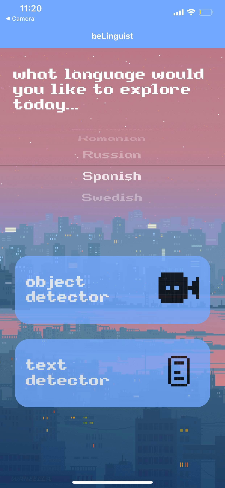
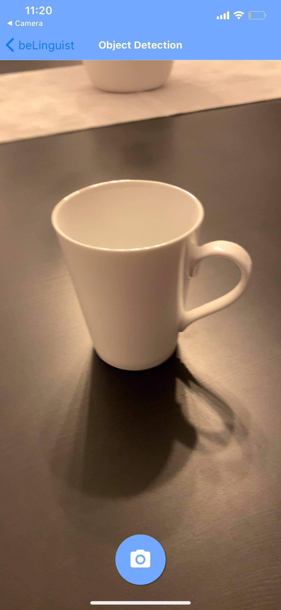
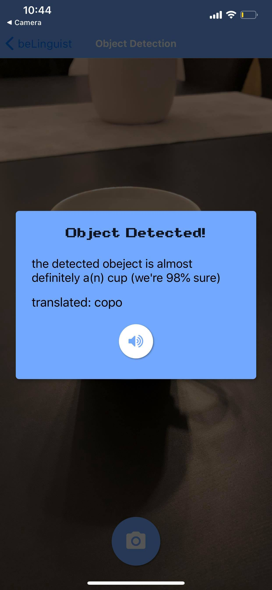
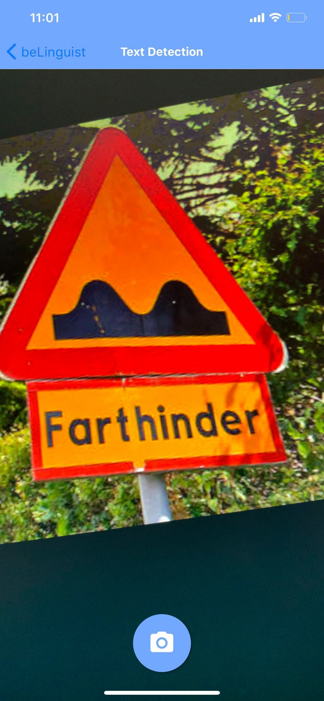
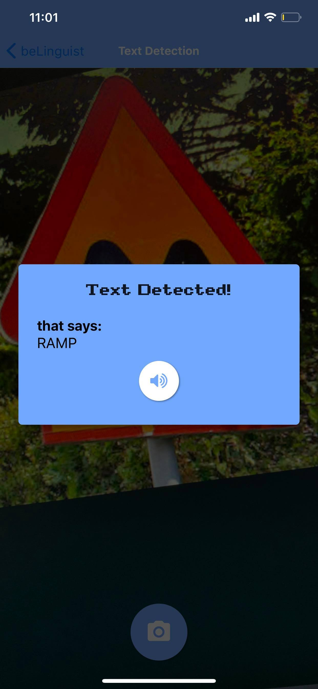

# beLinguist
beLinguist is an object &amp; text detection + translation React Native mobile app, utilizing Google's Cloud API

## getting started
1. change the 'credential.js' file and add your Google Cloud API key
2. download node.js 
3. download expo app on your phone
4. in your console, in the project directory, type 'npm install', then 'npm install expo-cli', then 'expo start'

## preview
on your home screen, you'll be able to choose which language you want to translate objects to

here's how the object detector works:

 

here's how the text detector works:

 

