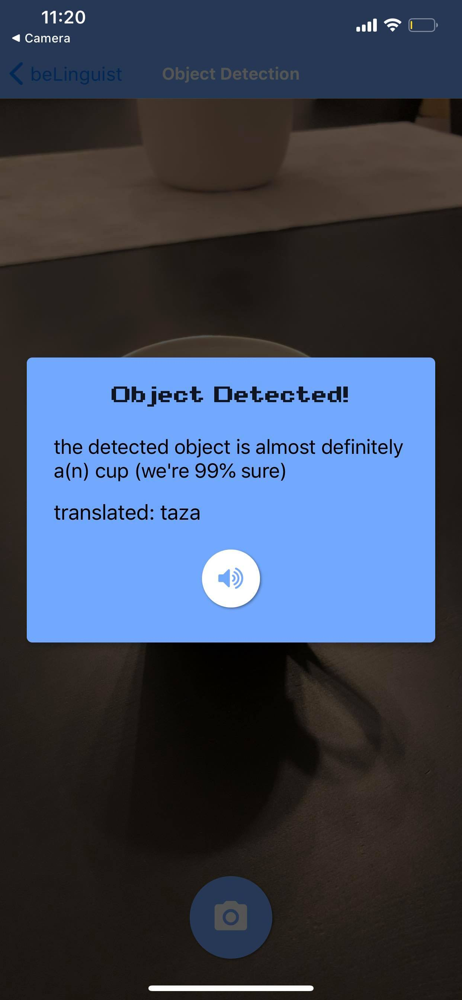

# beLinguist
beLinguist is an object &amp; text detection + translation React Native mobile app, utilizing Google's Cloud API

## getting started

--

## preview
on your home screen, you'll be able to choose which language you want to translate objects to

here's how the object detector works:

 

here's how the text detector works:

 

